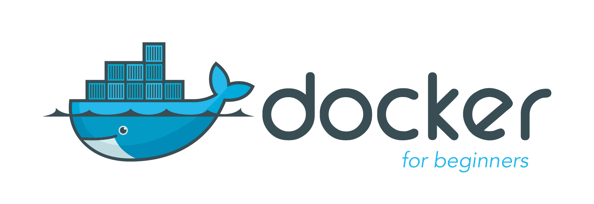
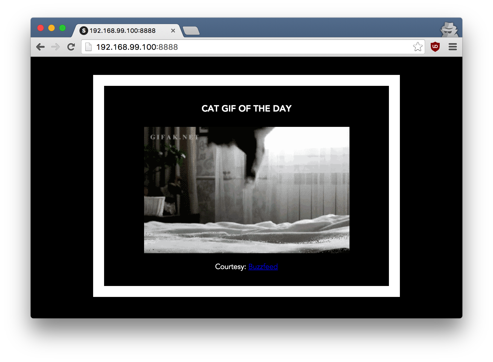

<a id="top"></a>


*Learn to build and deploy your distributed applications easily to the cloud with Docker*

This tutorial was originally written and developed by [Prakhar Srivastav](http://prakhar.me) and modified by [David Sweeney](https://adaptiman.github.io) for TCMG303 to include how to setup an Azure VM as a Docker development VM as well as deploying Docker images to Azure using Azure Cloud Registry (ACR) and Azure Container Service.

<a href="#top" class="top" id="getting-started">Top</a>

## Getting Started: FAQs

### What is Docker?
Wikipedia defines [Docker](https://www.docker.com/) as

> an open-source project that automates the deployment of software applications inside **containers** by providing an additional layer of abstraction and automation of **OS-level virtualization** on Linux.

Wow! That's a mouthful. In simpler words, Docker is a tool that allows developers, sys-admins etc. to easily deploy their applications in a sandbox (called *containers*) to run on the host operating system i.e. Linux. The key benefit of Docker is that it allows users to **package an application with all of its dependencies into a standardized unit** for software development. Unlike virtual machines, containers do not have the high overhead and hence enable more efficient usage of the underlying system and resources.


### What are containers?

The industry standard today is to use Virtual Machines (VMs) to run software applications. VMs run applications inside a guest Operating System, which runs on virtual hardware powered by the server’s host OS.

VMs are great at providing full process isolation for applications: there are very few ways a problem in the host operating system can affect the software running in the guest operating system, and vice-versa. But this isolation comes at great cost — the computational overhead spent virtualizing hardware for a guest OS to use is substantial.

Containers take a different approach: by leveraging the low-level mechanics of the host operating system, containers provide most of the isolation of virtual machines at a fraction of the computing power.

### Why should I use it?

Docker's rise has been nothing short of meteoric. Although containers by themselves are not a new technology, it was not until Docker arrived that they started to get mainstream attention. By providing standard APIs that made containers easy to use and creating a way for the community to collaborate around libraries of containers, Docker has radically changed the face of the technology landscape. In an article published by [The Register](http://www.theregister.co.uk/2014/05/23/google_containerization_two_billion/) in mid-2014, it was claimed that Google runs over **two billion containers per week**.

**Google Trends for 'Docker'**


In addition to Docker's continual growth, Docker, Inc., the developer behind Docker has been valued at over a billion dollars! Due to its benefits of efficiency and portability, Docker has been gaining mind share rapidly, and is now leading the **Containerization** movement. As developers going out into the world, it is important that we understand this trend and see how we can benefit from it.

### What will this tutorial teach me?
This tutorial aims to be the one-stop shop for getting your hands dirty with Docker. Apart from demystifying the Docker landscape, it'll give you hands-on experience with building and deploying your own webapps on the Cloud. We'll be using [Azure Web Services](http://portal.azure.com) to deploy a static website. Even if you have no prior experience with deployments, this tutorial should be all you need to get started.

## Using this Document
This document contains a series of several sections, each of which explains a particular aspect of Docker. In each section, we will be typing commands (or writing code).

<a href="#top" class="top" id="table-of-contents">Top</a>
## Table of Contents

-	[Preface](#preface)
-	[Pre-requisites](#prerequisites)
-	[Setting up your Docker Virtual Machine](#setup)
    - [Setting up your local machine](#lm)
    - [Creating an Azure VM](#vm)
    - [Cloning the Lab 9 Repo](#repo)
    - [Setting up Docker](#docker)
- [1.0 Playing with Busybox](#busybox)
  - [1.1 Docker Run](#dockerrun)
  - [1.2 Terminology](#terminology)
- [2.0 Webapps with Docker](#webapps)
  - [2.1 Static Sites](#static-site)
  - [2.2 Docker Images](#docker-images)
  - [2.3 Our First Image](#our-image)
  - [2.4 Dockerfile](#dockerfiles)
  - [2.5 Docker on Azure](#docker-azure)
- [3.0 Submitting the Lab](#submitlab)
- [References](#references)


------------------------------
<a href="#table-of-contents" class="top" id="preface">Top</a>
## Preface

> Note: This tutorial uses version **1.40** of Docker Community Edition. If you find any part of the tutorial incompatible with a future version, please raise an [issue](https://github.com/adaptiman/docker-curriculum/issues). Thanks!

<a id="prerequisites"></a>
### Prerequisites
There are no specific skills needed for this tutorial beyond a basic comfort with the command line and using a text editor. Prior experience in developing web applications will be helpful but is not required. As we proceed further along the tutorial, we'll make use of a few cloud services. If you're interested in following along, please create an account on each of these websites:

- [Azure Web Services](http://azure.microsoft.com/en-us/)
- [Docker Hub](https://hub.docker.com/)

<a id="setup"></a>
### Setting up your Docker Virtual Machine
Getting all the tooling setup on your computer can be a daunting task, but thankfully as Docker has become stable, getting Docker up and running on your favorite OS has become very easy. First, we'll install some tools on our local machine, then create an Azure VM and install Docker on the VM.

<a id="lm"></a>
#### Setting up your Local Machine
In order to connect to your Azure VM, I suggest installing puTTY. puTTY is a free ssh client that has support for a rich terminal experience as well as key-based authentication, which saves time.

##### Installing PuTTY
Installing puTTY is easy. Follow the instructions on [https://www.ssh.com/ssh/putty/](https://www.ssh.com/ssh/putty/) for your operating system. 

After installing the software, setup your keys based upon the SSH key documentation in the above instructions. You will use puttygen to do this.

<a id="vm"></a>
#### Creating your Azure Virtual Machine (VM)
By this point, you should have an Azure login account and subscription. I've made a video on [How to Create an Azure VM](https://drive.google.com/open?id=1GrskT7kkci9lT_cNFlDeP7-yiaFM99yv). There are several settings that will be different for this particular VM.

* Use the Standard D2s v3 (2 vcpus, 8 GiB memory)
* Deploy in South Central Region
* Use the Ubuntu 18.04 image
* Setup SSH rather than username and password. You will need to copy the public key you created when you installed puTTY.

Once this image is created, connect to it using puTTY.
> TIP: This setup is NOT a free Azure service. I would suggest that you stop your Docker VM when you're not using it so that your Azure credit is not continually charged.

<a id="repo"></a>
#### Cloning the Lab 9 Repo

Now that your VM is up and running, take a minute to clone the Lab 9 repo so you'll have a copy of the lab files in your VM:

```
$ cd ~
$ git clone git@github.com:adaptiman/lab9.git
```


<a id="docker"></a>
#### Installing Docker in your VM
Instructions for installing Docker on Ubuntu can be found at [https://docs.docker.com/install/linux/docker-ce/ubuntu/](https://docs.docker.com/install/linux/docker-ce/ubuntu/). For simplicity, I have summarized the commands here:

```
$ sudo apt update
$ sudo apt upgrade
$ sudo apt install apt-transport-https ca-certificates curl gnupg-agent software-properties-common
$ curl -fsSL https://download.docker.com/linux/ubuntu/gpg | sudo apt-key add -
$ curl -sL https://aka.ms/InstallAzureCLIDeb | sudo bash
$ sudo apt-key fingerprint 0EBFCD88
$ sudo add-apt-repository "deb [arch=amd64] https://download.docker.com/linux/ubuntu $(lsb_release -cs) stable"
$ sudo apt update
$ sudo apt install docker-ce docker-ce-cli containerd.io
$ apt-cache madison docker-ce
$ sudo apt install docker-ce=5:19.03.8~3-0~ubuntu-bionic docker-ce-cli=5:19.03.8~3-0~ubuntu-bionic containerd.io
$ sudo docker run hello-world
$ sudo usermod -aG docker $USER
```

After executing these commands, reboot the VM and then log back in using puTTY. To automatically start Docker when the VM is started/restarted, use the following command:
```
$ sudo systemctl enable docker
```
##### Docker 
Until a few releases ago, running Docker on OSX and Windows was quite a hassle. Lately however, Docker has invested significantly into improving the on-boarding experience for its users on these OSes, thus running Docker now is a cakewalk. The *getting started* guide on Docker has detailed instructions for setting up Docker on [Mac](https://www.docker.com/products/docker#/mac), [Linux](https://www.docker.com/products/docker#/linux) and [Windows](https://www.docker.com/products/docker#/windows).

Once you are done installing Docker, test your Docker installation by running the following:
```
$ docker run hello-world

Hello from Docker.
This message shows that your installation appears to be working correctly.
...
```
___________

<a href="#table-of-contents" class="top" id="preface">Top</a>
<a id="busybox"></a>
## 1.0 Playing with Busybox
Now that we have everything setup, it's time to get our hands dirty. In this section, we are going to run a [Busybox](https://en.wikipedia.org/wiki/BusyBox) container on our system and get a taste of the `docker run` command.

To get started, let's run the following in our terminal:
```
$ docker pull busybox
```

> Note: Depending on how you've installed docker on your system, you might see a `permission denied` error after running the above command. If you're on a Mac, make sure the Docker engine is running. If you're on Linux, then prefix your `docker` commands with `sudo`. Alternatively you can [create a docker group](https://docs.docker.com/engine/installation/linux/ubuntulinux/#create-a-docker-group) to get rid of this issue.

The `pull` command fetches the busybox [**image**](https://hub.docker.com/_/busybox/) from the [**Docker registry**](https://hub.docker.com/explore/) and saves it to our system. You can use the `docker images` command to see a list of all images on your system.
```
$ docker images
REPOSITORY              TAG                 IMAGE ID            CREATED             VIRTUAL SIZE
busybox                 latest              c51f86c28340        4 weeks ago         1.109 MB
```

<a id="dockerrun"></a>
### 1.1 Docker Run
Great! Let's now run a Docker **container** based on this image. To do that we are going to use the almighty `docker run` command.

```
$ docker run busybox
$
```
Wait, nothing happened! Is that a bug? Well, no. Behind the scenes, a lot of stuff happened. When you call `run`, the Docker client finds the image (busybox in this case), loads up the container and then runs a command in that container. When we run `docker run busybox`, we didn't provide a command, so the container booted up, ran an empty command and then exited. Well, yeah - kind of a bummer. Let's try something more exciting.

```
$ docker run busybox echo "hello from busybox"
hello from busybox
```
Nice - finally we see some output. In this case, the Docker client dutifully ran the `echo` command in our busybox container and then exited it. If you've noticed, all of that happened pretty quickly. Imagine booting up a virtual machine, running a command and then killing it. Now you know why they say containers are fast! Ok, now it's time to see the `docker ps` command. The `docker ps` command shows you all containers that are currently running.

```
$ docker ps
CONTAINER ID        IMAGE               COMMAND             CREATED             STATUS              PORTS               NAMES
```
Since no containers are running, we see a blank line. Let's try a more useful variant: `docker ps -a`
```
$ docker ps -a
CONTAINER ID        IMAGE               COMMAND             CREATED             STATUS                      PORTS               NAMES
305297d7a235        busybox             "uptime"            11 minutes ago      Exited (0) 11 minutes ago                       distracted_goldstine
ff0a5c3750b9        busybox             "sh"                12 minutes ago      Exited (0) 12 minutes ago                       elated_ramanujan
```
So what we see above is a list of all containers that we ran. Do notice that the `STATUS` column shows that these containers exited a few minutes ago.

You're probably wondering if there is a way to run more than just one command in a container. Let's try that now:
```
$ docker run -it busybox sh
/ # ls
bin   dev   etc   home  proc  root  sys   tmp   usr   var
/ # uptime
 05:45:21 up  5:58,  0 users,  load average: 0.00, 0.01, 0.04
```
Running the `run` command with the `-it` flags attaches us to an interactive tty in the container. Now we can run as many commands in the container as we want. Take some time to run your favorite commands.

> **Danger Zone**: If you're feeling particularly adventurous you can try `rm -rf bin` in the container. Make sure you run this command in the container and **not** in your laptop. Doing this will not make any other commands like `ls`, `echo` work. Once everything stops working, you can exit the container (type `exit` and press Enter) and then start it up again with the `docker run -it busybox sh` command. Since Docker creates a new container every time, everything should start working again.

That concludes a whirlwind tour of the mighty `docker run` command, which would most likely be the command you'll use most often. It makes sense to spend some time getting comfortable with it. To find out more about `run`, use `docker run --help` to see a list of all flags it supports. As we proceed further, we'll see a few more variants of `docker run`.

Before we move ahead though, let's quickly talk about deleting containers. We saw above that we can still see remnants of the container even after we've exited by running `docker ps -a`. Throughout this tutorial, you'll run `docker run` multiple times and leaving stray containers will eat up disk space. Hence, as a rule of thumb, I clean up containers once I'm done with them. To do that, you can run the `docker rm` command. Just copy the container IDs from above and paste them alongside the command.

```
$ docker rm 305297d7a235 ff0a5c3750b9
305297d7a235
ff0a5c3750b9
```

On deletion, you should see the IDs echoed back to you. If you have a bunch of containers to delete in one go, copy-pasting IDs can be tedious. In that case, you can simply run -

```
$ docker rm $(docker ps -a -q -f status=exited)
```
This command deletes all containers that have a status of `exited`. In case you're wondering, the `-q` flag, only returns the numeric IDs and `-f` filters output based on conditions provided. One last thing that'll be useful is the `--rm` flag that can be passed to `docker run` which automatically deletes the container once it's exited from. For one off docker runs, `--rm` flag is very useful.

Lastly, you can also delete images that you no longer need by running `docker rmi`.

<a id="terminology"></a>
### 1.2 Terminology
In the last section, we used a lot of Docker-specific jargon which might be confusing to some. So before we go further, let me clarify some terminology that is used frequently in the Docker ecosystem.

- *Images* - The blueprints of our application which form the basis of containers. In the demo above, we used the `docker pull` command to download the **busybox** image.
- *Containers* - Created from Docker images and run the actual application. We create a container using `docker run` which we did using the busybox image that we downloaded. A list of running containers can be seen using the `docker ps` command.
- *Docker Daemon* - The background service running on the host that manages building, running and distributing Docker containers. The daemon is the process that runs in the operation system to which clients talk to.
- *Docker Client* - The command line tool that allows the user to interact with the daemon. More generally, there can be other forms of clients too - such as [Kitematic](https://kitematic.com/) which provide a GUI to the users.
- *Docker Hub* - A [registry](https://hub.docker.com/explore/) of Docker images. You can think of the registry as a directory of all available Docker images. If required, one can host their own Docker registries and can use them for pulling images.

<a href="#table-of-contents" class="top" id="preface">Top</a>
<a id="webapps"></a>
## 2.0 Webapps with Docker
Great! So we have now looked at `docker run`, played with a Docker container and also got a hang of some terminology. Armed with all this knowledge, we are now ready to get to the real-stuff, i.e. deploying web applications with Docker!

<a id="static-site"></a>
### 2.1 Static Sites
Let's start by taking baby-steps. The first thing we're going to look at is how we can run a dead-simple static website. We're going to pull a Docker image from Docker Hub, run the container and see how easy it is to run a webserver.

Let's begin. The image that we are going to use is a single-page [website](http://github.com/prakhar1989/docker-curriculum) that I've already created for the purpose of this demo and hosted on the [registry](https://hub.docker.com/r/prakhar1989/static-site/) - `prakhar1989/static-site`. We can download and run the image directly in one go using `docker run`.

```
$ docker run prakhar1989/static-site
```
Since the image doesn't exist locally, the client will first fetch the image from the registry and then run the image. If all goes well, you should see a `Nginx is running...` message in your terminal. Okay now that the server is running, how do see the website? What port is it running on? And more importantly, how do we access the container directly from our host machine?

Well in this case, the client is not exposing any ports so we need to re-run the `docker run` command to publish ports. While we're at it, we should also find a way so that our terminal is not attached to the running container. This way, you can happily close your terminal and keep the container running. This is called **detached** mode.

```
$ docker run -d -P --name static-site prakhar1989/static-site
e61d12292d69556eabe2a44c16cbd54486b2527e2ce4f95438e504afb7b02810
```

In the above command, `-d` will detach our terminal, `-P` will publish all exposed ports to random ports and finally `--name` corresponds to a name we want to give. Now we can see the ports by running the `docker port [CONTAINER]` command

```
$ docker port static-site
80/tcp -> 0.0.0.0:32769
443/tcp -> 0.0.0.0:32768
```

You can open [http://localhost:32769](http://localhost:32769) in your browser. What? It didn't work? Hmm. Well, do you have the host port open on your machine? For example, if you're running this container on a cloud-based VM, chances are you must explicitly open the port for it to be exposed to the world.

> Note: If you're using docker-toolbox, then you might need to use `docker-machine ip default` to get the IP. 

You can also specify a custom port to which the client will forward connections to the container. 

```
$ docker run -p 8888:80 prakhar1989/static-site
Nginx is running...
```


To stop a detached container, run `docker stop` by giving the container ID. 

I'm sure you agree that was super simple. To deploy this on a real server you would just need to install Docker, and run the above Docker command. Now that you've seen how to run a webserver inside a Docker image, you must be wondering - how do I create my own Docker image? This is the question we'll be exploring in the next section.


<a id="docker-images"></a>
### 2.2 Docker Images

We've looked at images before, but in this section we'll dive deeper into what Docker images are and build our own image! Lastly, we'll also use that image to run our application locally and finally deploy on [Azure](http://portal.azure.com) to share it with our friends! Excited? Great! Let's get started.

Docker images are the basis of containers. In the previous example, we **pulled** the *Busybox* image from the registry and asked the Docker client to run a container **based** on that image. To see the list of images that are available locally, use the `docker images` command.

```
$ docker images
REPOSITORY                      TAG                 IMAGE ID            CREATED             VIRTUAL SIZE
prakhar1989/catnip              latest              c7ffb5626a50        2 hours ago         697.9 MB
prakhar1989/static-site         latest              b270625a1631        21 hours ago        133.9 MB
python                          3-onbuild           cf4002b2c383        5 days ago          688.8 MB
martin/docker-cleanup-volumes   latest              b42990daaca2        7 weeks ago         22.14 MB
ubuntu                          latest              e9ae3c220b23        7 weeks ago         187.9 MB
busybox                         latest              c51f86c28340        9 weeks ago         1.109 MB
hello-world                     latest              0a6ba66e537a        11 weeks ago        960 B
```

The above gives a list of images that I've pulled from the registry, along with ones that I've created myself (we'll shortly see how). The `TAG` refers to a particular snapshot of the image and the `IMAGE ID` is the corresponding unique identifier for that image.

For simplicity, you can think of an image akin to a git repository - images can be [committed](https://docs.docker.com/engine/reference/commandline/commit/) with changes and have multiple versions. If you don't provide a specific version number, the client defaults to `latest`. For example, you can pull a specific version of `ubuntu` image
```
$ docker pull ubuntu:18.04
```

To get a new Docker image you can either get it from a registry (such as the Docker Hub) or create your own. There are tens of thousands of images available on [Docker Hub](https://hub.docker.com/explore/). You can also search for images directly from the command line using `docker search`.

An important distinction to be aware of when it comes to images is the difference between base and child images.

- **Base images** are images that have no parent image, usually images with an OS like ubuntu, busybox or debian.

- **Child images** are images that build on base images and add additional functionality.

Then there are official and user images, which can be both base and child images.

- **Official images** are images that are officially maintained and supported by the folks at Docker. These are typically one word long. In the list of images above, the `python`, `ubuntu`, `busybox` and `hello-world` images are base images.

- **User images** are images created and shared by users like you and me. They build on base images and add additional functionality. Typically, these are formatted as `user/image-name`.

<a id="our-image"></a>
### 2.3 Our First Image

Now that we have a better understanding of images, it's time to create our own. Our goal in this section will be to create an image that sandboxes a simple [Flask](http://flask.pocoo.org) application. For the purposes of this workshop, I've already created a fun little [Flask app](https://github.com/adaptiman/lab9/tree/master/flask-app) that displays a random cat `.gif` every time it is loaded - because you know, who doesn't like cats? 

If you haven't already, , take a minute to clone the Lab 9 repo so you'll have a copy of the lab files in your VM:

```
$ cd ~
$ git clone git@github.com:adaptiman/lab9.git
```

Before we get started creating the image, let's first test that the application works correctly locally. Step one is to `cd` into the `flask-app` directory and install the dependencies
```
$ sudo apt install -y python-pip
$ cd ~/lab9/flask-app
$ pip install -r requirements.txt
$ python app.py
 * Serving Flask app "app" (lazy loading)
 * Environment: production
   WARNING: This is a development server. Do not use it in a production deployment.
   Use a production WSGI server instead.
 * Debug mode: off
 * Running on http://0.0.0.0:5000/ (Press CTRL+C to quit)
```

If all goes well, you should see the output as above. Head over to [http://localhost:5000](http://localhost:5000) to see the app in action. (Make sure that port 5000 is open on your VM.)

> Note: If `pip install` is giving you permission denied errors, you might need to try running the command as `sudo`. If you prefer not installing packages system-wide, you can instead try `pip install --user -r requirements.txt`.

Looks great doesn't it? The next step now is to create an image with this web app. As mentioned above, all user images are based off of a base image. Since our application is written in Python, the base image we're going to use will be [Python 3](https://hub.docker.com/_/python/). More specifically, we are going to use the `python:3-onbuild` version of the python image.

What's the `onbuild` version you might ask?

> These images include multiple ONBUILD triggers, which should be all you need to bootstrap most applications. The build will COPY a `requirements.txt` file, RUN `pip install` on said file, and then copy the current directory into `/usr/src/app`.

In other words, the `onbuild` version of the image includes helpers that automate the boring parts of getting an app running. Rather than doing these tasks manually (or scripting these tasks), these images do that work for you. We now have all the ingredients to create our own image - a functioning web app and a base image. How are we going to do that? The answer is - using a **Dockerfile**.

<a id="dockerfiles"></a>
### 2.4 Dockerfile

A [Dockerfile](https://docs.docker.com/engine/reference/builder/) is a simple text-file that contains a list of commands that the Docker client calls while creating an image. It's a simple way to automate the image creation process. The best part is that the [commands](https://docs.docker.com/engine/reference/builder/#from) you write in a Dockerfile are *almost* identical to their equivalent Linux commands. This means you don't really have to learn new syntax to create your own dockerfiles.

The application directory does contain a Dockerfile but since we're doing this for the first time, we'll create one from scratch. To start, create a new blank file in our favorite text-editor and save it in the **same** folder as the flask app by the name of `Dockerfile`.

We start with specifying our base image. Use the `FROM` keyword to do that -
```
FROM python:3-onbuild
```
The next step usually is to write the commands of copying the files and installing the dependencies. Luckily for us, the `onbuild` version of the image takes care of that. The next thing we need to the specify is the port number that needs to be exposed. Since our flask app is running on port `5000`, that's what we'll indicate.
```
EXPOSE 5000
```
The last step is to write the command for running the application, which is simply - `python ./app.py`. We use the [CMD](https://docs.docker.com/engine/reference/builder/#cmd) command to do that -
```
CMD ["python", "./app.py"]
```

The primary purpose of `CMD` is to tell the container which command it should run when it is started. With that, our `Dockerfile` is now ready. This is how it looks like -
```
# our base image
FROM python:3-onbuild

# specify the port number the container should expose
EXPOSE 5000

# run the application
CMD ["python", "./app.py"]
```

Now that we have our `Dockerfile`, we can build our image. The `docker build` command does the heavy-lifting of creating a Docker image from a `Dockerfile`.

The section below shows you the output of running the same. Before you run the command yourself (don't forget the period), make sure to replace my username with yours. This username should be the same one you created when you registered on [Docker hub](https://hub.docker.com). If you haven't done that yet, please go ahead and create an account. The `docker build` command is quite simple - it takes an optional tag name with `-t` and a location of the directory containing the `Dockerfile`.

```
$ docker build -t adaptiman/catnip .
Sending build context to Docker daemon  8.192kB
Step 1/3 : FROM python:3-onbuild
3-onbuild: Pulling from library/python
[...]
Step 2/3 : EXPOSE 5000
 ---> Running in 7a9434fababd
Removing intermediate container 7a9434fababd
 ---> 32a55367a26c
Step 3/3 : CMD ["python", "./app.py"]
 ---> Running in 004c941f5b9c
Removing intermediate container 004c941f5b9c
 ---> 05e89a25a119
Successfully built 05e89a25a119
Successfully tagged adaptiman/catnip:latest
```

If you don't have the `python:3-onbuild` image, the client will first pull the image and then create your image. Hence, your output from running the command will look different from mine. Look carefully and you'll notice that the on-build triggers were executed correctly. If everything went well, your image should be ready! Run `docker images` and see if your image shows.

The last step in this section is to run the image and see if it actually works (replacing my username with yours).
```
$ docker run -p 8888:5000 adaptiman/catnip
 * Running on http://0.0.0.0:5000/ (Press CTRL+C to quit)
```
Head over to the URL specified, where your app should be live.



Congratulations! You have successfully created your first docker image.

<a id="docker-azure"></a>
### 2.5 Docker on Azure

What good is an application that can't be shared with friends, right? So in this section we are going to see how we can deploy our awesome application to the cloud so that we can share it with our friends! We're going to use Azure  [App Service](https://azure.microsoft.com/en-us/services/app-service/) to get our application up and running in a few clicks. We'll also see how easy it is to make our application scalable and manageable with App Service!

##### Docker push
The first thing that we need to do before we deploy our app to Azure is to publish our image on a registry which can be accessed by Azure. There are many different Docker registries include [AWS Elastic Container Registry](https://aws.amazon.com/ecr/), [Azure Container Registry](https://azure.microsoft.com/en-us/services/container-registry/), and [Docker Hub](https://hub.docker.com/). You can even host [your own](https://docs.docker.com/registry/deploying/). For now, let's use [Docker Hub](https://hub.docker.com) to publish the image. To publish, just type
```
$ docker push adaptiman/catnip
```
Remember to replace the name of the image tag above with yours. It is important to have the format of `username/image_name` so that the client knows where to publish.

If this is the first time you are pushing an image, the client will ask you to login. Provide the same credentials that you used for logging into Docker Hub.

```
$ docker login
Username: <yourdockerhubname>
Authenticating with existing credentials...
WARNING! Your password will be stored unencrypted in /home/adaptiman/.docker/config.json.
Configure a credential helper to remove this warning. See
https://docs.docker.com/engine/reference/commandline/login/#credentials-store

Login Succeeded
$
```

Once that is done, you can view your image on Docker Hub. For example, here's the [web page](https://hub.docker.com/r/adaptiman/catnip/) for my image.

> Note: One thing that I'd like to clarify before we go ahead is that it is not **imperative** to host your image on a public registry (or any registry) in order to deploy to a cloud service provider. In case you're writing code for the next million-dollar unicorn startup, you can totally skip this step. The reason why we're pushing our images publicly is that it makes deployment super simple by skipping a few intermediate configuration steps.

Now that your image is online, anyone who has docker installed can play with your app by typing just a single command.
```
$ docker run -p 8888:5000 adaptiman/catnip
```
If you've pulled your hair in setting up local dev environments / sharing application configuration in the past, you very well know how awesome this sounds. That's why Docker is so cool!


##### Azure App Services
Azure App Services is a PaaS (Platform as a Service) offered by Microsoft.  As a developer/system administrator, you just tell App Services how to run your app and it takes care of the rest - including scaling, monitoring and even updates. App Services has support for running container orchestration using Kubernetes, or single-container Docker deployments which is what we'll use to deploy our app. Although Azure App Service has a good [CLI](https://docs.microsoft.com/en-us/cli/azure/?view=azure-cli-latest), it does require some setup, and to keep things simple we'll use the web UI to launch our application.

To follow along, you need a functioning [Azure](http://portal.azure.com) account. If you haven't already, please go ahead and do that now - you may need to send me your email address so I can update your Azure credits. Please refer to the course Announcements in eCampus. Let's get started.

Here are the steps:

- Login to your Azure [portal](http://portal.azure.com).
- Click on App Services. If it's not displayed, search for it in the top search box. From the App Services Window, click `+Add` to get the Web App page:


- Select the `Microsoft Azure Sponsorship 2` subscription
- Create a new Resource Group labeled `Lab9RG`
- Name your app as `<githubname>-catnip`, for example adaptiman-catnip. **It's very important to name your app in this format as this is how I will confirm your grade for this lab**
- In the Publish field, select `Docker Container`
- In the Operating System field, select `Linux`
- In the Region, Select `South Central US`
- Leave the default App Service Plan
- Click `Next: Docker`

The following screen is shown below. 


- In the Options field, select `Single Container`
- In the Image Source field, select `Docker Hub`
- In the Access Type field, select `Public`
- In the Image and Tag field, enter your image namge as `<dockerhubname>/catnip`, for example adaptiman/catnip (My docker name is coincidentally the same as my Github name).
- Leave the Startup Command blank, as the entrypoint is specified in the Dockerfile.
- Click `Review + Create`
- If there are no errors, Click `Create`
 
While we wait, you should know that is also possible to generate scripts that will clone the resource you just created. After it finishes deploying, go the resource's page, and click on `Get publish profile` at the top of the screen. This will download an XML file with the necessary information to duplicate this resource.

Hopefully by now, our instance should be ready. Head over to the  resource's page and you should see the associated information, including the public address of the app resource.


Go ahead and open the URL in your browser and you should see the application in all its glory. Feel free to email / IM / snapchat this link to your friends and family so that they can enjoy a few cat gifs, too.

Congratulations! You have deployed your first Docker application in Azure App Services! That might seem like a lot of steps, but with the command-line tool for Azure, you can automate the entire process in a few keystrokes! Hopefully you agree that Docker takes away a lot of the pains of building and deploying applications in the cloud. I would encourage you to read about diferent type of [Azure containers](https://azure.microsoft.com/en-us/product-categories/containers/) to get an idea of what features exist.

___________

<a href="#table-of-contents" class="top" id="preface">Top</a>
<a id="submitlab"></a>
## 3.0 Submitting the Lab

In order to submit, the lab, you should complete all of the steps listed in this document. Then, on your Docker Development VM, run the vm_report program filling in the required information:
```
$ ~/lab9/vm_report

Collecting information about the VM...
Found Docker 19.03.8
Found IPv4 address 40.124.1.142
Your name: David Sweeney
GitHub username: adaptiman
TAMU UIN: 501001234

Sending payload...
Response returned with code 200 (good). Your VM has been recorded.
$

```
The program should return a 200 (good) code. If not, please contact me for further instructions.
___________

<a href="#table-of-contents" class="top" id="preface">Top</a>
<a id="references"></a>
## References
- [What containers can do for you](http://radar.oreilly.com/2015/01/what-containers-can-do-for-you.html)
- [What is Docker](https://www.docker.com/what-docker)
- [A beginner's guide to deploying production web apps](https://medium.com/@j_mcnally/a-beginner-s-guide-to-deploying-production-web-apps-to-docker-9458409c6180?_tmc=WrhaI1ejJlMmTpUmHOhTFZsYaUSPUP1yvyq19dsRQ5A#.bl50ga0uz)
- [Running Web Application in Linked Docker Containers Environment](https://aggarwalarpit.wordpress.com/2015/12/06/running-web-application-in-linked-docker-containers-environment/)
